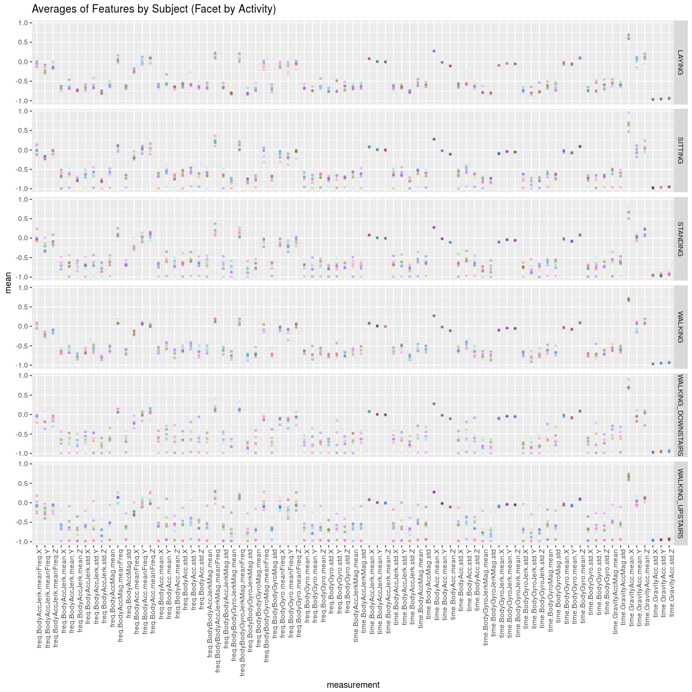

# Human Activity Recognition (HAR) Using Smartphones - Codebook
Wagner Pinheiro  
February, 2017  


In this CodeBook is demonstrated all the functions necessary to tidy the dataset and all the results after running the source code.


## HAR.download()

Before we can tidy the data, we need to download and unzip the dataset using the HAR.download function.

Source code:

```r
source("run_analysis.R")
HAR.download
```

```
## function (Config = HAR.Config) 
## {
##     file = paste0(Config$data_path, Config$file_zipped)
##     if (!file.exists(file)) {
##         if (!dir.exists(Config$data_path)) {
##             dir.create(Config$data_path)
##         }
##         download.file(Config$url, file)
##     }
##     if (!dir.exists(paste0(Config$data_path, "dataset"))) {
##         unzip(file, exdir = Config$data_path)
##         file.rename(paste0(Config$data_path, "UCI HAR Dataset"), 
##             paste0(Config$data_path, "dataset"))
##     }
##     paste0("Dataset downloaded and unzipped in folder: ", Config$data_path, 
##         "dataset")
## }
```

Running the HAR.download():

```r
HAR.download()
```

```
## [1] "Dataset downloaded and unzipped in folder: ./data/dataset"
```

## HAR.load()

This function load a defined dataset passed as parameter ("train" or "test"), 


```r
HAR.load
```

```
## function (dataset = "train", Config = HAR.Config) 
## {
##     if (!file.exists(paste0(Config$data_path, "dataset/features.txt"))) {
##         HAR.download(Config)
##     }
##     feature_list <- read.table(paste0(Config$data_path, "dataset/features.txt"), 
##         col.names = c("id", "name"))
##     activity_labels <- read.table(paste0(Config$data_path, "dataset/activity_labels.txt"), 
##         col.names = c("activity_id", "activity"))
##     feature_labels <- feature_list[, "name"]
##     feature_labels <- HAR.describeFeatures(feature_labels)
##     x <- read.table(paste0(Config$data_path, "dataset/", dataset, 
##         "/X_", dataset, ".txt"), col.names = feature_labels)
##     y <- read.table(paste0(Config$data_path, "dataset/", dataset, 
##         "/y_", dataset, ".txt"), col.names = c("activity_id"))
##     y <- merge(y, activity_labels, by.x = "activity_id", by.y = "activity_id", 
##         all.x = TRUE)
##     sub <- read.table(paste0(Config$data_path, "dataset/", dataset, 
##         "/subject_", dataset, ".txt"), col.names = c("subject"))
##     data <- cbind(x, sub, y)
##     data
## }
```


```r
test_data <- HAR.load("test")
dim(test_data)
```

```
## [1] 2947  564
```

In the ***HAR.load()*** function we merge the features with the activity names, to: **3. Uses descriptive activity names to name the activities in the data set**:


```r
y <- merge(y, activity_labels, by.x = "activity_id", by.y ="activity_id", all.x=TRUE)
```


## HAR.loadAndMerge()

For load and merge the train and test data, we call the HAR.loadAndMerge function:


```r
HAR.loadAndMerge
```

```
## function (Config = HAR.Config) 
## {
##     train_data <- HAR.load(dataset = "train", Config = Config)
##     test_data <- HAR.load(dataset = "test", Config = Config)
##     data <- rbind(train_data, test_data)
##     data
## }
```

Running the HAR.loadAndMerge to **1. Merges the training and the test sets to create one data set**:


```r
full_dataset <- HAR.loadAndMerge()
str(full_dataset)
```

```
## 'data.frame':	10299 obs. of  564 variables:
##  $ time.BodyAcc.mean.X                 : num  0.289 0.278 0.28 0.279 0.277 ...
##  $ time.BodyAcc.mean.Y                 : num  -0.0203 -0.0164 -0.0195 -0.0262 -0.0166 ...
##  $ time.BodyAcc.mean.Z                 : num  -0.133 -0.124 -0.113 -0.123 -0.115 ...
##  $ time.BodyAcc.std.X                  : num  -0.995 -0.998 -0.995 -0.996 -0.998 ...
##  $ time.BodyAcc.std.Y                  : num  -0.983 -0.975 -0.967 -0.983 -0.981 ...
##  $ time.BodyAcc.std.Z                  : num  -0.914 -0.96 -0.979 -0.991 -0.99 ...
##  $ time.BodyAcc.mad.X                  : num  -0.995 -0.999 -0.997 -0.997 -0.998 ...
##  $ time.BodyAcc.mad.Y                  : num  -0.983 -0.975 -0.964 -0.983 -0.98 ...
##  $ time.BodyAcc.mad.Z                  : num  -0.924 -0.958 -0.977 -0.989 -0.99 ...
##  $ time.BodyAcc.max.X                  : num  -0.935 -0.943 -0.939 -0.939 -0.942 ...
##  $ time.BodyAcc.max.Y                  : num  -0.567 -0.558 -0.558 -0.576 -0.569 ...
##  $ time.BodyAcc.max.Z                  : num  -0.744 -0.818 -0.818 -0.83 -0.825 ...
##  $ time.BodyAcc.min.X                  : num  0.853 0.849 0.844 0.844 0.849 ...
##  $ time.BodyAcc.min.Y                  : num  0.686 0.686 0.682 0.682 0.683 ...
##  $ time.BodyAcc.min.Z                  : num  0.814 0.823 0.839 0.838 0.838 ...
##  $ time.BodyAcc.sma                    : num  -0.966 -0.982 -0.983 -0.986 -0.993 ...
##  $ time.BodyAcc.energy.X               : num  -1 -1 -1 -1 -1 ...
##  $ time.BodyAcc.energy.Y               : num  -1 -1 -1 -1 -1 ...
##  $ time.BodyAcc.energy.Z               : num  -0.995 -0.998 -0.999 -1 -1 ...
##  $ time.BodyAcc.iqr.X                  : num  -0.994 -0.999 -0.997 -0.997 -0.998 ...
##  $ time.BodyAcc.iqr.Y                  : num  -0.988 -0.978 -0.965 -0.984 -0.981 ...
##  $ time.BodyAcc.iqr.Z                  : num  -0.943 -0.948 -0.975 -0.986 -0.991 ...
##  $ time.BodyAcc.entropy.X              : num  -0.408 -0.715 -0.592 -0.627 -0.787 ...
##  $ time.BodyAcc.entropy.Y              : num  -0.679 -0.501 -0.486 -0.851 -0.559 ...
##  $ time.BodyAcc.entropy.Z              : num  -0.602 -0.571 -0.571 -0.912 -0.761 ...
##  $ time.BodyAcc.arCoeff.X.1            : num  0.9293 0.6116 0.273 0.0614 0.3133 ...
##  $ time.BodyAcc.arCoeff.X.2            : num  -0.853 -0.3295 -0.0863 0.0748 -0.1312 ...
##  $ time.BodyAcc.arCoeff.X.3            : num  0.36 0.284 0.337 0.198 0.191 ...
##  $ time.BodyAcc.arCoeff.X.4            : num  -0.0585 0.2846 -0.1647 -0.2643 0.0869 ...
##  $ time.BodyAcc.arCoeff.Y.1            : num  0.2569 0.1157 0.0172 0.0725 0.2576 ...
##  $ time.BodyAcc.arCoeff.Y.2            : num  -0.2248 -0.091 -0.0745 -0.1553 -0.2725 ...
##  $ time.BodyAcc.arCoeff.Y.3            : num  0.264 0.294 0.342 0.323 0.435 ...
##  $ time.BodyAcc.arCoeff.Y.4            : num  -0.0952 -0.2812 -0.3326 -0.1708 -0.3154 ...
##  $ time.BodyAcc.arCoeff.Z.1            : num  0.279 0.086 0.239 0.295 0.44 ...
##  $ time.BodyAcc.arCoeff.Z.2            : num  -0.4651 -0.0222 -0.1362 -0.3061 -0.2691 ...
##  $ time.BodyAcc.arCoeff.Z.3            : num  0.4919 -0.0167 0.1739 0.4821 0.1794 ...
##  $ time.BodyAcc.arCoeff.Z.4            : num  -0.191 -0.221 -0.299 -0.47 -0.089 ...
##  $ time.BodyAcc.correlation.X.Y        : num  0.3763 -0.0134 -0.1247 -0.3057 -0.1558 ...
##  $ time.BodyAcc.correlation.X.Z        : num  0.4351 -0.0727 -0.1811 -0.3627 -0.1898 ...
##  $ time.BodyAcc.correlation.Y.Z        : num  0.661 0.579 0.609 0.507 0.599 ...
##  $ time.GravityAcc.mean.X              : num  0.963 0.967 0.967 0.968 0.968 ...
##  $ time.GravityAcc.mean.Y              : num  -0.141 -0.142 -0.142 -0.144 -0.149 ...
##  $ time.GravityAcc.mean.Z              : num  0.1154 0.1094 0.1019 0.0999 0.0945 ...
##  $ time.GravityAcc.std.X               : num  -0.985 -0.997 -1 -0.997 -0.998 ...
##  $ time.GravityAcc.std.Y               : num  -0.982 -0.989 -0.993 -0.981 -0.988 ...
##  $ time.GravityAcc.std.Z               : num  -0.878 -0.932 -0.993 -0.978 -0.979 ...
##  $ time.GravityAcc.mad.X               : num  -0.985 -0.998 -1 -0.996 -0.998 ...
##  $ time.GravityAcc.mad.Y               : num  -0.984 -0.99 -0.993 -0.981 -0.989 ...
##  $ time.GravityAcc.mad.Z               : num  -0.895 -0.933 -0.993 -0.978 -0.979 ...
##  $ time.GravityAcc.max.X               : num  0.892 0.892 0.892 0.894 0.894 ...
##  $ time.GravityAcc.max.Y               : num  -0.161 -0.161 -0.164 -0.164 -0.167 ...
##  $ time.GravityAcc.max.Z               : num  0.1247 0.1226 0.0946 0.0934 0.0917 ...
##  $ time.GravityAcc.min.X               : num  0.977 0.985 0.987 0.987 0.987 ...
##  $ time.GravityAcc.min.Y               : num  -0.123 -0.115 -0.115 -0.121 -0.122 ...
##  $ time.GravityAcc.min.Z               : num  0.0565 0.1028 0.1028 0.0958 0.0941 ...
##  $ time.GravityAcc.sma                 : num  -0.375 -0.383 -0.402 -0.4 -0.4 ...
##  $ time.GravityAcc.energy.X            : num  0.899 0.908 0.909 0.911 0.912 ...
##  $ time.GravityAcc.energy.Y            : num  -0.971 -0.971 -0.97 -0.969 -0.967 ...
##  $ time.GravityAcc.energy.Z            : num  -0.976 -0.979 -0.982 -0.982 -0.984 ...
##  $ time.GravityAcc.iqr.X               : num  -0.984 -0.999 -1 -0.996 -0.998 ...
##  $ time.GravityAcc.iqr.Y               : num  -0.989 -0.99 -0.992 -0.981 -0.991 ...
##  $ time.GravityAcc.iqr.Z               : num  -0.918 -0.942 -0.993 -0.98 -0.98 ...
##  $ time.GravityAcc.entropy.X           : num  -1 -1 -1 -1 -1 -1 -1 -1 -1 -1 ...
##  $ time.GravityAcc.entropy.Y           : num  -1 -1 -1 -1 -1 -1 -1 -1 -1 -1 ...
##  $ time.GravityAcc.entropy.Z           : num  0.114 -0.21 -0.927 -0.596 -0.617 ...
##  $ time.GravityAcc.arCoeff.X.1         : num  -0.59042 -0.41006 0.00223 -0.06493 -0.25727 ...
##  $ time.GravityAcc.arCoeff.X.2         : num  0.5911 0.4139 0.0275 0.0754 0.2689 ...
##  $ time.GravityAcc.arCoeff.X.3         : num  -0.5918 -0.4176 -0.0567 -0.0858 -0.2807 ...
##  $ time.GravityAcc.arCoeff.X.4         : num  0.5925 0.4213 0.0855 0.0962 0.2926 ...
##  $ time.GravityAcc.arCoeff.Y.1         : num  -0.745 -0.196 -0.329 -0.295 -0.167 ...
##  $ time.GravityAcc.arCoeff.Y.2         : num  0.7209 0.1253 0.2705 0.2283 0.0899 ...
##  $ time.GravityAcc.arCoeff.Y.3         : num  -0.7124 -0.1056 -0.2545 -0.2063 -0.0663 ...
##  $ time.GravityAcc.arCoeff.Y.4         : num  0.7113 0.1091 0.2576 0.2048 0.0671 ...
##  $ time.GravityAcc.arCoeff.Z.1         : num  -0.995 -0.834 -0.705 -0.385 -0.237 ...
##  $ time.GravityAcc.arCoeff.Z.2         : num  0.996 0.834 0.714 0.386 0.239 ...
##  $ time.GravityAcc.arCoeff.Z.3         : num  -0.996 -0.834 -0.723 -0.387 -0.241 ...
##  $ time.GravityAcc.arCoeff.Z.4         : num  0.992 0.83 0.729 0.385 0.241 ...
##  $ time.GravityAcc.correlation.X.Y     : num  0.57 -0.831 -0.181 -0.991 -0.408 ...
##  $ time.GravityAcc.correlation.X.Z     : num  0.439 -0.866 0.338 -0.969 -0.185 ...
##  $ time.GravityAcc.correlation.Y.Z     : num  0.987 0.974 0.643 0.984 0.965 ...
##  $ time.BodyAccJerk.mean.X             : num  0.078 0.074 0.0736 0.0773 0.0734 ...
##  $ time.BodyAccJerk.mean.Y             : num  0.005 0.00577 0.0031 0.02006 0.01912 ...
##  $ time.BodyAccJerk.mean.Z             : num  -0.06783 0.02938 -0.00905 -0.00986 0.01678 ...
##  $ time.BodyAccJerk.std.X              : num  -0.994 -0.996 -0.991 -0.993 -0.996 ...
##  $ time.BodyAccJerk.std.Y              : num  -0.988 -0.981 -0.981 -0.988 -0.988 ...
##  $ time.BodyAccJerk.std.Z              : num  -0.994 -0.992 -0.99 -0.993 -0.992 ...
##  $ time.BodyAccJerk.mad.X              : num  -0.994 -0.996 -0.991 -0.994 -0.997 ...
##  $ time.BodyAccJerk.mad.Y              : num  -0.986 -0.979 -0.979 -0.986 -0.987 ...
##  $ time.BodyAccJerk.mad.Z              : num  -0.993 -0.991 -0.987 -0.991 -0.991 ...
##  $ time.BodyAccJerk.max.X              : num  -0.985 -0.995 -0.987 -0.987 -0.997 ...
##  $ time.BodyAccJerk.max.Y              : num  -0.992 -0.979 -0.979 -0.992 -0.992 ...
##  $ time.BodyAccJerk.max.Z              : num  -0.993 -0.992 -0.992 -0.99 -0.99 ...
##  $ time.BodyAccJerk.min.X              : num  0.99 0.993 0.988 0.988 0.994 ...
##  $ time.BodyAccJerk.min.Y              : num  0.992 0.992 0.992 0.993 0.993 ...
##  $ time.BodyAccJerk.min.Z              : num  0.991 0.989 0.989 0.993 0.986 ...
##  $ time.BodyAccJerk.sma                : num  -0.994 -0.991 -0.988 -0.993 -0.994 ...
##  $ time.BodyAccJerk.energy.X           : num  -1 -1 -1 -1 -1 ...
##  $ time.BodyAccJerk.energy.Y           : num  -1 -1 -1 -1 -1 ...
##  $ time.BodyAccJerk.energy.Z           : num  -1 -1 -1 -1 -1 ...
##   [list output truncated]
```


## HAR.extractMeanAndStdFields()

For **2. Extracts only the measurements on the mean and standard deviation for each measurement**, we use the auxiliary function HAR.extractMeanAndStdFields to ***grep*** only the variables with 'mean' and 'std' in they names. This auxiliary function is used in the previous executed ***HAR.load*** function.

Source code:

```r
HAR.extractMeanAndStdFields
```

```
## function (data) 
## {
##     data[, grepl("mean|std|subject|activity", names(data))]
## }
```

Running HAR.extractMeanAndStdFields:

```r
partial_dataset <- HAR.extractMeanAndStdFields(full_dataset)
str(partial_dataset)
```

```
## 'data.frame':	10299 obs. of  82 variables:
##  $ time.BodyAcc.mean.X              : num  0.289 0.278 0.28 0.279 0.277 ...
##  $ time.BodyAcc.mean.Y              : num  -0.0203 -0.0164 -0.0195 -0.0262 -0.0166 ...
##  $ time.BodyAcc.mean.Z              : num  -0.133 -0.124 -0.113 -0.123 -0.115 ...
##  $ time.BodyAcc.std.X               : num  -0.995 -0.998 -0.995 -0.996 -0.998 ...
##  $ time.BodyAcc.std.Y               : num  -0.983 -0.975 -0.967 -0.983 -0.981 ...
##  $ time.BodyAcc.std.Z               : num  -0.914 -0.96 -0.979 -0.991 -0.99 ...
##  $ time.GravityAcc.mean.X           : num  0.963 0.967 0.967 0.968 0.968 ...
##  $ time.GravityAcc.mean.Y           : num  -0.141 -0.142 -0.142 -0.144 -0.149 ...
##  $ time.GravityAcc.mean.Z           : num  0.1154 0.1094 0.1019 0.0999 0.0945 ...
##  $ time.GravityAcc.std.X            : num  -0.985 -0.997 -1 -0.997 -0.998 ...
##  $ time.GravityAcc.std.Y            : num  -0.982 -0.989 -0.993 -0.981 -0.988 ...
##  $ time.GravityAcc.std.Z            : num  -0.878 -0.932 -0.993 -0.978 -0.979 ...
##  $ time.BodyAccJerk.mean.X          : num  0.078 0.074 0.0736 0.0773 0.0734 ...
##  $ time.BodyAccJerk.mean.Y          : num  0.005 0.00577 0.0031 0.02006 0.01912 ...
##  $ time.BodyAccJerk.mean.Z          : num  -0.06783 0.02938 -0.00905 -0.00986 0.01678 ...
##  $ time.BodyAccJerk.std.X           : num  -0.994 -0.996 -0.991 -0.993 -0.996 ...
##  $ time.BodyAccJerk.std.Y           : num  -0.988 -0.981 -0.981 -0.988 -0.988 ...
##  $ time.BodyAccJerk.std.Z           : num  -0.994 -0.992 -0.99 -0.993 -0.992 ...
##  $ time.BodyGyro.mean.X             : num  -0.0061 -0.0161 -0.0317 -0.0434 -0.034 ...
##  $ time.BodyGyro.mean.Y             : num  -0.0314 -0.0839 -0.1023 -0.0914 -0.0747 ...
##  $ time.BodyGyro.mean.Z             : num  0.1077 0.1006 0.0961 0.0855 0.0774 ...
##  $ time.BodyGyro.std.X              : num  -0.985 -0.983 -0.976 -0.991 -0.985 ...
##  $ time.BodyGyro.std.Y              : num  -0.977 -0.989 -0.994 -0.992 -0.992 ...
##  $ time.BodyGyro.std.Z              : num  -0.992 -0.989 -0.986 -0.988 -0.987 ...
##  $ time.BodyGyroJerk.mean.X         : num  -0.0992 -0.1105 -0.1085 -0.0912 -0.0908 ...
##  $ time.BodyGyroJerk.mean.Y         : num  -0.0555 -0.0448 -0.0424 -0.0363 -0.0376 ...
##  $ time.BodyGyroJerk.mean.Z         : num  -0.062 -0.0592 -0.0558 -0.0605 -0.0583 ...
##  $ time.BodyGyroJerk.std.X          : num  -0.992 -0.99 -0.988 -0.991 -0.991 ...
##  $ time.BodyGyroJerk.std.Y          : num  -0.993 -0.997 -0.996 -0.997 -0.996 ...
##  $ time.BodyGyroJerk.std.Z          : num  -0.992 -0.994 -0.992 -0.993 -0.995 ...
##  $ time.BodyAccMag.mean             : num  -0.959 -0.979 -0.984 -0.987 -0.993 ...
##  $ time.BodyAccMag.std              : num  -0.951 -0.976 -0.988 -0.986 -0.991 ...
##  $ time.GravityAccMag.mean          : num  -0.959 -0.979 -0.984 -0.987 -0.993 ...
##  $ time.GravityAccMag.std           : num  -0.951 -0.976 -0.988 -0.986 -0.991 ...
##  $ time.BodyAccJerkMag.mean         : num  -0.993 -0.991 -0.989 -0.993 -0.993 ...
##  $ time.BodyAccJerkMag.std          : num  -0.994 -0.992 -0.99 -0.993 -0.996 ...
##  $ time.BodyGyroMag.mean            : num  -0.969 -0.981 -0.976 -0.982 -0.985 ...
##  $ time.BodyGyroMag.std             : num  -0.964 -0.984 -0.986 -0.987 -0.989 ...
##  $ time.BodyGyroJerkMag.mean        : num  -0.994 -0.995 -0.993 -0.996 -0.996 ...
##  $ time.BodyGyroJerkMag.std         : num  -0.991 -0.996 -0.995 -0.995 -0.995 ...
##  $ freq.BodyAcc.mean.X              : num  -0.995 -0.997 -0.994 -0.995 -0.997 ...
##  $ freq.BodyAcc.mean.Y              : num  -0.983 -0.977 -0.973 -0.984 -0.982 ...
##  $ freq.BodyAcc.mean.Z              : num  -0.939 -0.974 -0.983 -0.991 -0.988 ...
##  $ freq.BodyAcc.std.X               : num  -0.995 -0.999 -0.996 -0.996 -0.999 ...
##  $ freq.BodyAcc.std.Y               : num  -0.983 -0.975 -0.966 -0.983 -0.98 ...
##  $ freq.BodyAcc.std.Z               : num  -0.906 -0.955 -0.977 -0.99 -0.992 ...
##  $ freq.BodyAcc.meanFreq.X          : num  0.252 0.271 0.125 0.029 0.181 ...
##  $ freq.BodyAcc.meanFreq.Y          : num  0.1318 0.0429 -0.0646 0.0803 0.058 ...
##  $ freq.BodyAcc.meanFreq.Z          : num  -0.0521 -0.0143 0.0827 0.1857 0.5598 ...
##  $ freq.BodyAccJerk.mean.X          : num  -0.992 -0.995 -0.991 -0.994 -0.996 ...
##  $ freq.BodyAccJerk.mean.Y          : num  -0.987 -0.981 -0.982 -0.989 -0.989 ...
##  $ freq.BodyAccJerk.mean.Z          : num  -0.99 -0.99 -0.988 -0.991 -0.991 ...
##  $ freq.BodyAccJerk.std.X           : num  -0.996 -0.997 -0.991 -0.991 -0.997 ...
##  $ freq.BodyAccJerk.std.Y           : num  -0.991 -0.982 -0.981 -0.987 -0.989 ...
##  $ freq.BodyAccJerk.std.Z           : num  -0.997 -0.993 -0.99 -0.994 -0.993 ...
##  $ freq.BodyAccJerk.meanFreq.X      : num  0.8704 0.6085 0.1154 0.0358 0.2734 ...
##  $ freq.BodyAccJerk.meanFreq.Y      : num  0.2107 -0.0537 -0.1934 -0.093 0.0791 ...
##  $ freq.BodyAccJerk.meanFreq.Z      : num  0.2637 0.0631 0.0383 0.1681 0.2924 ...
##  $ freq.BodyGyro.mean.X             : num  -0.987 -0.977 -0.975 -0.987 -0.982 ...
##  $ freq.BodyGyro.mean.Y             : num  -0.982 -0.993 -0.994 -0.994 -0.993 ...
##  $ freq.BodyGyro.mean.Z             : num  -0.99 -0.99 -0.987 -0.987 -0.989 ...
##  $ freq.BodyGyro.std.X              : num  -0.985 -0.985 -0.977 -0.993 -0.986 ...
##  $ freq.BodyGyro.std.Y              : num  -0.974 -0.987 -0.993 -0.992 -0.992 ...
##  $ freq.BodyGyro.std.Z              : num  -0.994 -0.99 -0.987 -0.989 -0.988 ...
##  $ freq.BodyGyro.meanFreq.X         : num  -0.2575 -0.0482 -0.2167 0.2169 -0.1533 ...
##  $ freq.BodyGyro.meanFreq.Y         : num  0.0979 -0.4016 -0.0173 -0.1352 -0.0884 ...
##  $ freq.BodyGyro.meanFreq.Z         : num  0.5472 -0.0682 -0.1107 -0.0497 -0.1622 ...
##  $ freq.BodyAccMag.mean             : num  -0.952 -0.981 -0.988 -0.988 -0.994 ...
##  $ freq.BodyAccMag.std              : num  -0.956 -0.976 -0.989 -0.987 -0.99 ...
##  $ freq.BodyAccMag.meanFreq         : num  -0.0884 -0.0441 0.2579 0.0736 0.3943 ...
##  $ freq.BodyBodyAccJerkMag.mean     : num  -0.994 -0.99 -0.989 -0.993 -0.996 ...
##  $ freq.BodyBodyAccJerkMag.std      : num  -0.994 -0.992 -0.991 -0.992 -0.994 ...
##  $ freq.BodyBodyAccJerkMag.meanFreq : num  0.347 0.532 0.661 0.679 0.559 ...
##  $ freq.BodyBodyGyroMag.mean        : num  -0.98 -0.988 -0.989 -0.989 -0.991 ...
##  $ freq.BodyBodyGyroMag.std         : num  -0.961 -0.983 -0.986 -0.988 -0.989 ...
##  $ freq.BodyBodyGyroMag.meanFreq    : num  -0.129 -0.272 -0.2127 -0.0357 -0.2736 ...
##  $ freq.BodyBodyGyroJerkMag.mean    : num  -0.992 -0.996 -0.995 -0.995 -0.995 ...
##  $ freq.BodyBodyGyroJerkMag.std     : num  -0.991 -0.996 -0.995 -0.995 -0.995 ...
##  $ freq.BodyBodyGyroJerkMag.meanFreq: num  -0.0743 0.1581 0.4145 0.4046 0.0878 ...
##  $ subject                          : int  1 1 1 1 1 1 1 1 1 1 ...
##  $ activity_id                      : int  1 1 1 1 1 1 1 1 1 1 ...
##  $ activity                         : Factor w/ 6 levels "LAYING","SITTING",..: 4 4 4 4 4 4 4 4 4 4 ...
```

## HAR.describeFeatures()

This function replace abbreviated features names, and is used in the ***HAR.load()*** function, for ***4. Appropriately labels the data set with descriptive variable names.***

Source code:

```r
HAR.describeFeatures
```

```
## function (feature_labels) 
## {
##     feature_labels <- gsub("\\(\\)", "", feature_labels)
##     feature_labels <- gsub("\\)", "", feature_labels)
##     feature_labels <- gsub(",", "-", feature_labels)
##     feature_labels <- gsub("\\(", "-", feature_labels)
##     feature_labels <- gsub("^(t)", "time-", feature_labels)
##     feature_labels <- gsub("^(f)", "freq-", feature_labels)
##     feature_labels
## }
```

## HAR.calcAvg()

Calculate the averages values for each variable.

Source code:

```r
HAR.calcAvg
```

```
## function (data) 
## {
##     tbl_df(data) %>% group_by(activity, subject) %>% summarise_each(funs(mean), 
##         -subject, -activity, -activity_id) %>% gather(measurement, 
##         mean, -subject, -activity)
## }
```

Running HAR.calcAvg:

```r
avgs_dataset <- HAR.calcAvg(partial_dataset)
str(avgs_dataset)
```

```
## Classes 'grouped_df', 'tbl_df', 'tbl' and 'data.frame':	3160 obs. of  4 variables:
##  $ activity   : Factor w/ 6 levels "LAYING","SITTING",..: 1 1 1 1 1 1 2 2 2 2 ...
##  $ subject    : int  20 24 27 28 29 30 12 13 17 18 ...
##  $ measurement: chr  "time.BodyAcc.mean.X" "time.BodyAcc.mean.X" "time.BodyAcc.mean.X" "time.BodyAcc.mean.X" ...
##  $ mean       : num  0.268 0.277 0.278 0.278 0.279 ...
##  - attr(*, "vars")=List of 1
##   ..$ : symbol activity
##  - attr(*, "drop")= logi TRUE
##  - attr(*, "indices")=List of 6
##   ..$ : int  0 1 2 3 4 5 40 41 42 43 ...
##   ..$ : int  6 7 8 9 10 11 12 46 47 48 ...
##   ..$ : int  13 14 15 16 17 18 19 53 54 55 ...
##   ..$ : int  20 21 22 23 24 25 60 61 62 63 ...
##   ..$ : int  26 27 28 29 30 31 66 67 68 69 ...
##   ..$ : int  32 33 34 35 36 37 38 39 72 73 ...
##  - attr(*, "group_sizes")= int  474 553 553 474 474 632
##  - attr(*, "biggest_group_size")= int 632
##  - attr(*, "labels")='data.frame':	6 obs. of  1 variable:
##   ..$ activity: Factor w/ 6 levels "LAYING","SITTING",..: 1 2 3 4 5 6
##   ..- attr(*, "vars")=List of 1
##   .. ..$ : symbol activity
##   ..- attr(*, "drop")= logi TRUE
```

## HAR.saveData()

Save the tidy dataset to a file.

Source code:

```r
HAR.saveData
```

```
## function (data, filename = "tidy_data_avgs.txt") 
## {
##     write.table(data, file = filename, row.name = FALSE)
## }
```

Running:

```r
HAR.saveData(data=avgs_dataset, filename="./data/tidy_data_avgs.txt")
file.info("./data/tidy_data_avgs.txt")
```

```
##                             size isdir mode               mtime
## ./data/tidy_data_avgs.txt 190430 FALSE  664 2017-02-03 14:25:43
##                                         ctime               atime  uid
## ./data/tidy_data_avgs.txt 2017-02-03 14:25:43 2017-02-03 14:19:54 1000
##                            gid  uname grname
## ./data/tidy_data_avgs.txt 1000 wagner wagner
```

## HAR.plotAvgs()

Plotting the results of averages coloured by subject:

```r
HAR.plotAvgs(avgs_dataset)
```

<!-- -->

