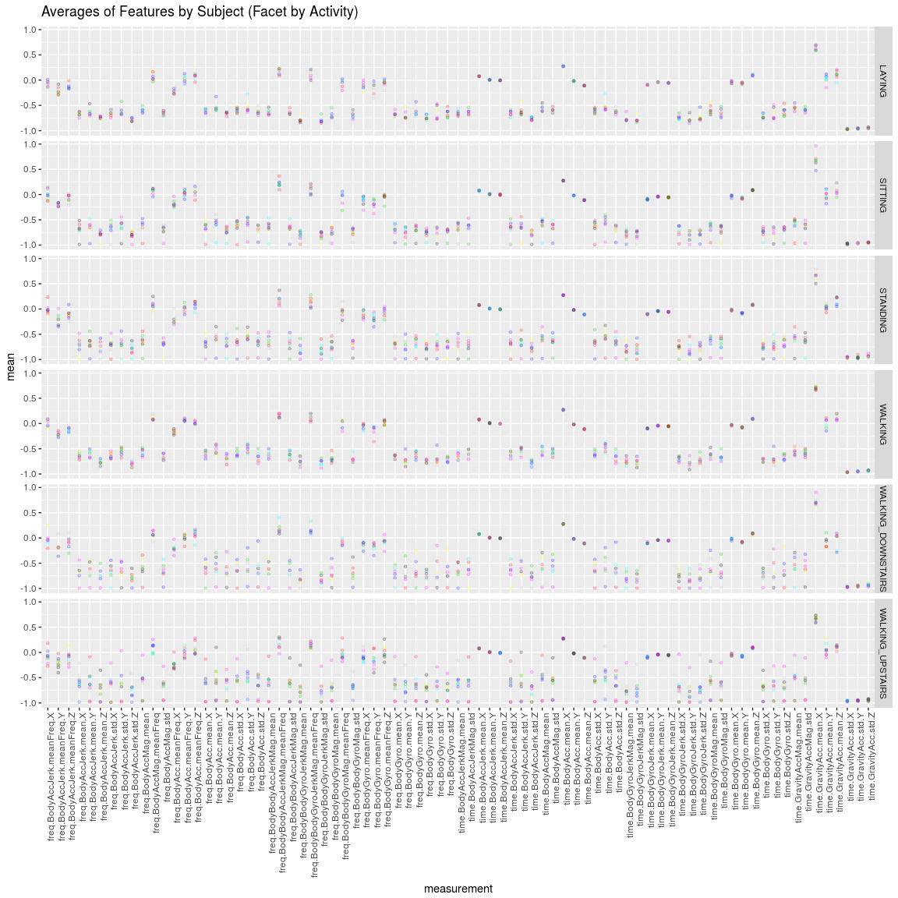

# Human Activity Recognition (HAR) Using Smartphones
Wagner Pinheiro  
February, 2017  

## Introduction

The purpose of this project is to download and clean the dataset from UCI "Human Activity Recognition Using Smartphones", and prepare tidy data that can be used for later analysis.

All the functions created for this project is in the ***[run_analysis.R](./run_analysis.R)*** file, and the demonstration of how you can use it is in the ***[CodeBook.md](./CodeBook.md)*** file.

## Plotted tidy dataset results

The resulting tidy dataset can be seen in this plot:

## Appendix I - How the Dataset was Collected

The experiments have been carried out with a group of 30 volunteers within an age bracket of 19-48 years. Each person performed six activities (WALKING, WALKING_UPSTAIRS, WALKING_DOWNSTAIRS, SITTING, STANDING, LAYING) wearing a smartphone (Samsung Galaxy S II) on the waist. Using its embedded accelerometer and gyroscope, we captured 3-axial linear acceleration and 3-axial angular velocity at a constant rate of 50Hz. The experiments have been video-recorded to label the data manually. The obtained dataset has been randomly partitioned into two sets, where 70% of the volunteers was selected for generating the training data and 30% the test data. 

The sensor signals (accelerometer and gyroscope) were pre-processed by applying noise filters and then sampled in fixed-width sliding windows of 2.56 sec and 50% overlap (128 readings/window). The sensor acceleration signal, which has gravitational and body motion components, was separated using a Butterworth low-pass filter into body acceleration and gravity. The gravitational force is assumed to have only low frequency components, therefore a filter with 0.3 Hz cutoff frequency was used. From each window, a vector of features was obtained by calculating variables from the time and frequency domain. See 'features_info.txt' for more details. 

## Appendix II - Getting and Cleaning Data Course Project

### Instructions

The purpose of this project is to demonstrate your ability to collect, work with, and clean a data set.

### Review criteria

1. The submitted data set is tidy.
1. The Github repo contains the required scripts.
1. GitHub contains a code book that modifies and updates the available codebooks with the data to indicate all the variables and summaries calculated, along with units, and any other relevant information.
1. The README that explains the analysis files is clear and understandable.
1. The work submitted for this project is the work of the student who submitted it.

### Getting and Cleaning Data Course Project

The purpose of this project is to demonstrate your ability to collect, work with, and clean a data set. The goal is to prepare tidy data that can be used for later analysis. You will be graded by your peers on a series of yes/no questions related to the project. You will be required to submit: 1) a tidy data set as described below, 2) a link to a Github repository with your script for performing the analysis, and 3) a code book that describes the variables, the data, and any transformations or work that you performed to clean up the data called CodeBook.md. You should also include a README.md in the repo with your scripts. This repo explains how all of the scripts work and how they are connected.

One of the most exciting areas in all of data science right now is wearable computing - see for example this article . Companies like Fitbit, Nike, and Jawbone Up are racing to develop the most advanced algorithms to attract new users. The data linked to from the course website represent data collected from the accelerometers from the Samsung Galaxy S smartphone. A full description is available at the site where the data was obtained:

http://archive.ics.uci.edu/ml/datasets/Human+Activity+Recognition+Using+Smartphones

Here are the data for the project:

https://d396qusza40orc.cloudfront.net/getdata%2Fprojectfiles%2FUCI%20HAR%20Dataset.zip

You should create one R script called run_analysis.R that does the following.

1. Merges the training and the test sets to create one data set.
1. Extracts only the measurements on the mean and standard deviation for each measurement.
1. Uses descriptive activity names to name the activities in the data set
1. Appropriately labels the data set with descriptive variable names.
1. From the data set in step 4, creates a second, independent tidy data set with the average of each variable for each activity and each subject.

